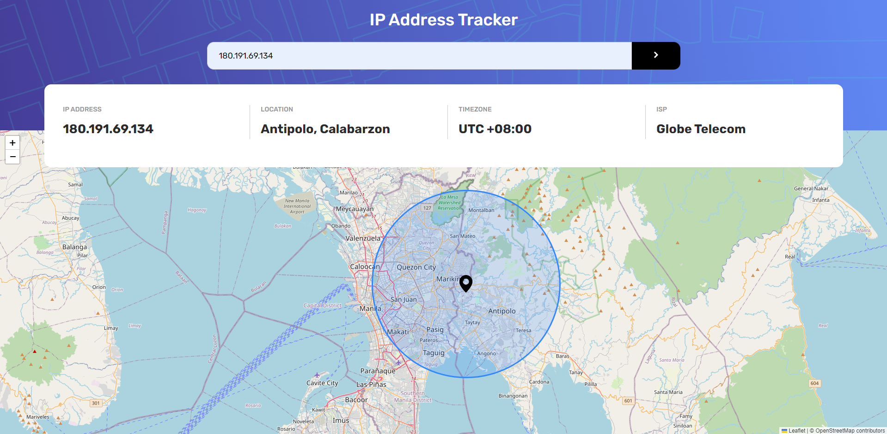

# Frontend Mentor - IP address tracker solution

## Table of contents

- [Frontend Mentor - IP address tracker solution](#frontend-mentor---ip-address-tracker-solution)
  - [Table of contents](#table-of-contents)
  - [Overview](#overview)
    - [The challenge](#the-challenge)
    - [Screenshot](#screenshot)
    - [Links](#links)
    - [Built with](#built-with)
    - [Useful resources](#useful-resources)

## Overview

### The challenge

Users should be able to:

- View the optimal layout for each page depending on their device's screen size
- See hover states for all interactive elements on the page
- See their own IP address on the map on the initial page load
- Search for any IP addresses or domains and see the key information and location

### Screenshot

### Links

- Live Site URL: [IP Address Tracker](https://ip-address-tracker-fementor.netlify.app/)

### Built with

- Semantic HTML5 markup
- CSS custom properties
- Flexbox
- Mobile-first workflow
- Typescript
- [Leaflet](https://leafletjs.com/) - JS library for interactive maps
- [IP Geolocation API](https://geo.ipify.org/) 
- [React](https://reactjs.org/) - JS library

### Useful resources

- [React Leaflet Tutorial for Beginners](https://www.youtube.com/watch?v=jD6813wGdBA) - This helped me understand the basics of using Leaflet.
